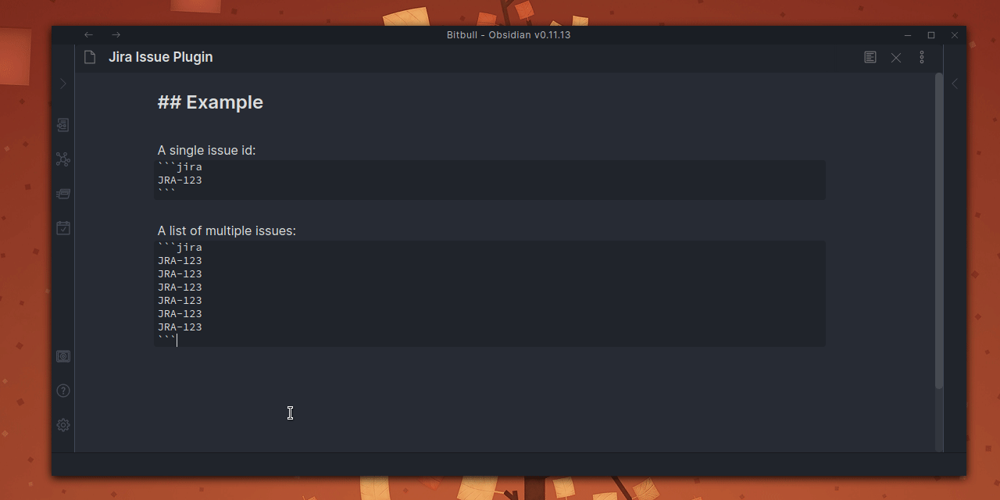
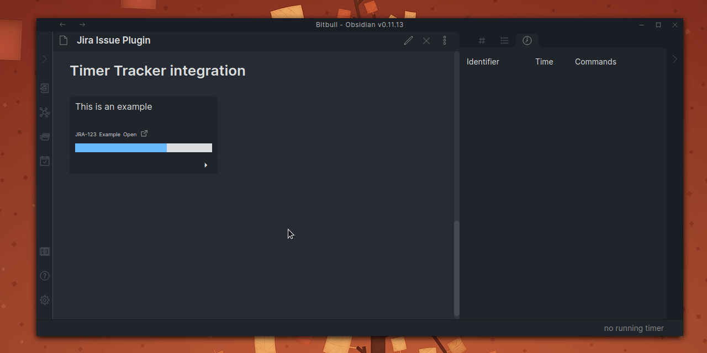

# Obsidian Jira Issue Plugin

An [Obsidian.md](https://obsidian.md/) plugin that show Jira issue details.

## Usage

Add this code block where you want to show the issue widget:
````makrdown
```jira
JRA-123
```
````

or add multiple keys, one for each line, to show a grid of widgets:
````makrdown
```jira
JRA-123
JRA-124
JRA-125
JRA-126
JRA-127
JRA-128
```
````

Open the preview mode to see issue's details:



## Usage with Time Tracker

This plugin is compatible with [Time Tracker Plugin](https://github.com/daaru00/obsidian-timer-tracker), you can start a timer and save it as Jira Work Log:


